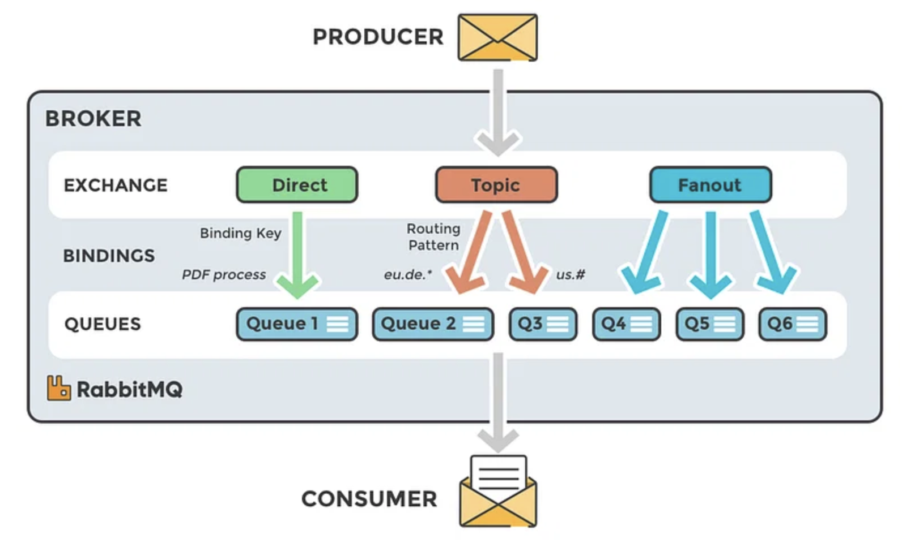
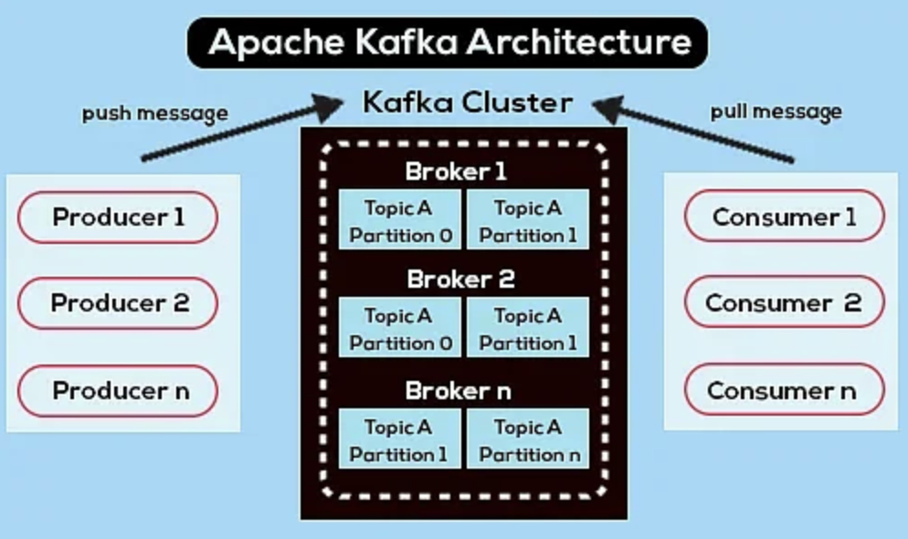
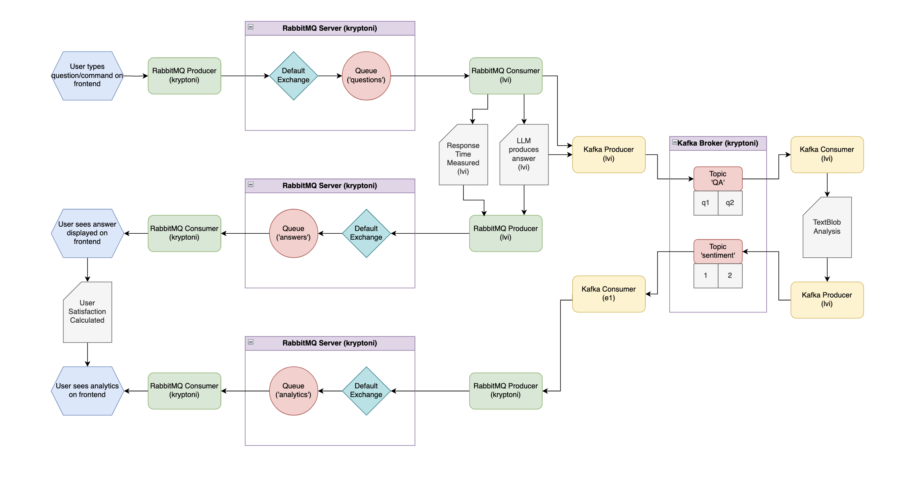

# cerebrasgpt-webapp

## Description

- Deploy a website that takes user text input and uses RabbitMQ to send that input to a language learning model

- After the model produces a response, RabbitMQ is used to send that output back to the website to be displayed to the user

- Kafka logs data and runs analytics, which is then displayed on the website as well

## Website Features
- text input field where users can type their inquiries or commands
- submit button that triggers RabbitMQ to send the user text input to the language learning model
- text output field where the response of the language learning model is displayed back to the user
- thumbs up and thumbs down buttons to allow user to show their overall satisfaction with the answer
- analytics page that displays user satisfaction, response time, and sentiment
- overall simple and easy to use interface

## Pipelines
### Question to Answer using LLM
1. User inputs question in website and presses submit button
2. Question gets directed to RabbitMQ producer
3. Question is added to the queue
4. Consumer picks up question and feeds it to LLM
5. LLM produces output and consumer calls a producer to send the output back to RabbitMQ
6. The message is then displayed in the answer box

## Analytics
1. User inputs question in website and presses submit button
2. Question and answer are directed to Kafka broker
3. Kafka consumer picks up questions and does sentiment analysis (Python TextBlob)
4. Results are produced and Kafka producer sends these logs back to Kafka broker in another topic
5. Kafka consumer picks up analysis and sends it to RabbitMQ
6. Graphs with analytics are displayed on analytics page

## Explanation of .txt files in data folder (main project)
- These txt files are used to generate our graphs that are displayed on the analytics.html page
    - This is currently old data from previously asked questions and generated answers. It will change when new questions are asked.

**TODO** use a database for this data instead of .txt files

## RabbitMQ Overview

- Message broker that uses an exchange to route messsages to a queue based on a binding key or routing key that is picked up by consumers 

- Push design = smart broker, dumb consumer

- Different types of exchange = direct, fanout, topic, headers (these are flexible message routing)

    - direct = message sent to every queue that has same routing key
    
    - fanout = send message to all queues attached to that fanout for broadcasting
    
    - topic = send messages based on pattern of routing keys + wildcard character (selects the queues that will receive the message)
    
    - headers = send messages and queue them based on headers rather than routing keys

: source link below

## Kafka Overview

- Message broker that stores messages in topics inside a broker that is pulled by consumers listening to a topic

- Pull design = dumb broker, smart consumer

- Topics - specify the kinds of data coming in from the producer, distinguishes data on semantics

- Partitions - containers that hold subsets of data from topic (multiple partitions per topic)

    - messages pushed cyclically among all partitions

- Message - key + value + offset field (order for inside partition), partitions may not be ordered but messages inside partitions will be (real time event streaming)

- Brokers - servers that store topics and partitions, big system has many brokers

: source link below

## Architecture

## Ansible

- Wrote 2 ansible scripts to automate install of RabbitMQ and Kafka
- [RabbitMQ](./ansible/rabbit.yml) 
- [Kafka](./ansible/install_kafka.yml)

## Magic 8 Ball Tutorial

- Set up a simple Flask web app that asks for a Yes or No Question. RabbitMQ producer sends question to consumer
to determine random answer, which sends back to the app to display on the answer page.

[Magic 8 Ball](./tutorials/Magic8BallTutorial.md)

## How to Train CerebrasGPT

- Tutorial to tune the CerebrasGPT model for our project.

[CerebrasGPT Tuning Tutorial](./tutorials/CerebrasGPTTune.md)

## VNC Tutorial

- Tutorial to use VNC Viewer for viewing web application. 

[VNC Tutorial](./tutorials/VNCTutorial.md)

- Simple hello world flask app to accompany VNC Tutorial

[Hello World](./tutorials/HelloWorldFlaskTutorial.md)

## Debugging Tips

- Debugging tips page for creation and installation of our web application.

[Debugging](./Debugging.md)

## Cited Works

1. RabbitMQ + architecture picture: https://www.cloudamqp.com/blog/part1-rabbitmq-for-beginners-what-is-rabbitmq.html

2. Install RabbitMQ: https://www.rabbitmq.com/install-rpm.html

3. Kafka: https://linuxconfig.org/how-to-install-kafka-on-redhat-8

4. Flask: https://flask.palletsprojects.com/en/2.3.x/

5. CerebrasGPT: https://www.listendata.com/2023/03/open-source-chatgpt-models-step-by-step.html#cerebrasgpt

6. Kafka Architecture picture: https://www.projectpro.io/article/apache-kafka-architecture-/442

7. Rabbit gif: https://giphy.com/explore/bunnyhopping

8. RabbitMQ vs Kafka: https://www.projectpro.io/article/kafka-vs-rabbitmq/451
