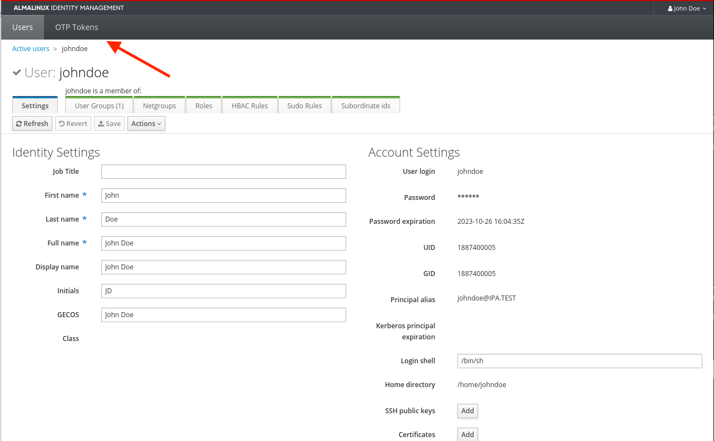
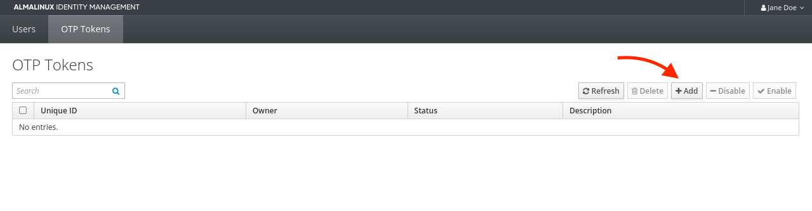
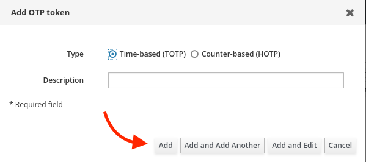
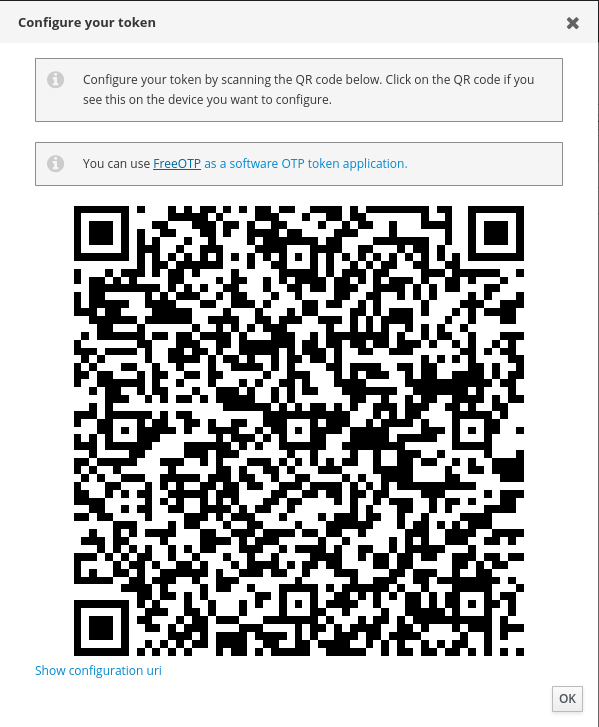
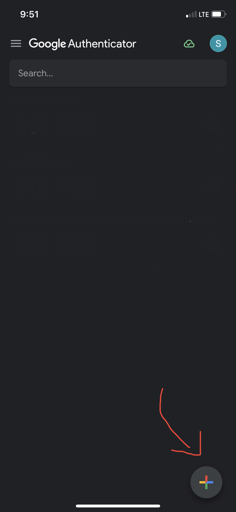
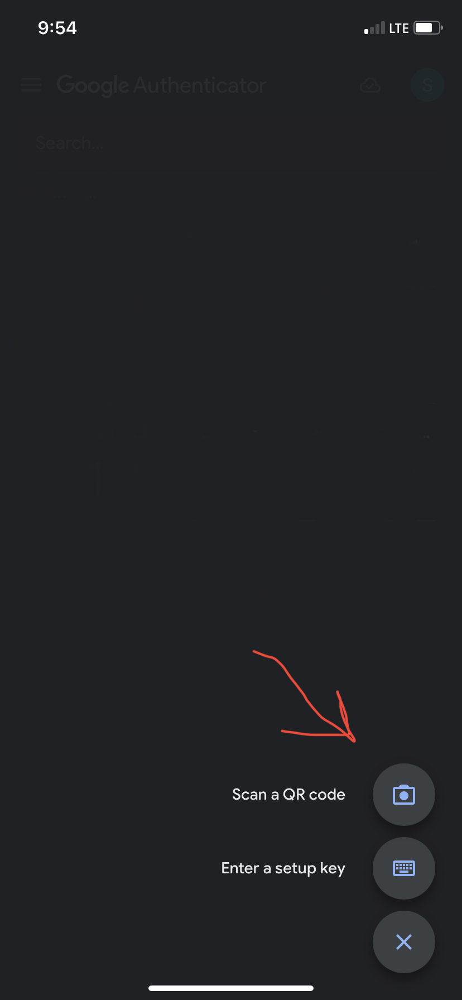
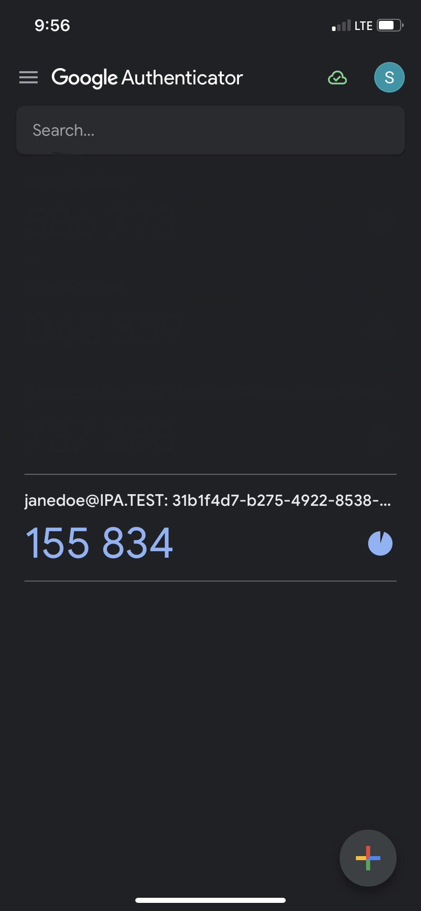
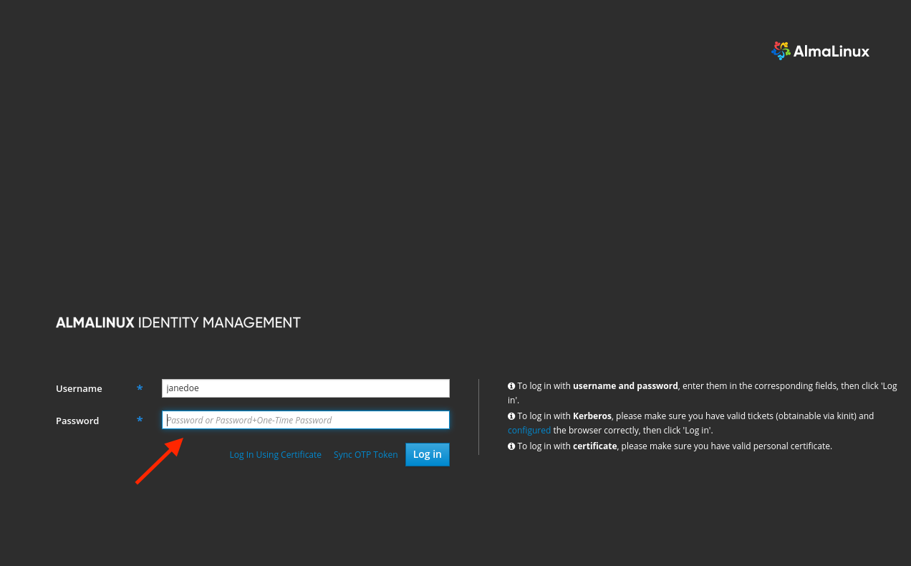

 

**Setting Up 2FA for FreeIPA User**

Make sure you have Google Authenticator downloaded on your phone or hardware device.

1. Login to your user via the Web UI. Click on the top of the homepage where it says OTP Tokens:

2. Select add and confirm TOTP. You'll be presented with a QR code.

    NOTE: Since we can't use our cameras on-site, we want to click on "Show configuration url" in the bottom left. Then type the token after

3. Scan this QR code within the Google Authenticator App (or if you're on-site click the first option). Select the plus icon in the bottom right, click QR code, and scan. You should now have a 6 digit code that is synced with FreeIPA

4. Logout of your user, and when you login, you enter your password and 6 digit code. Now you have 2FA login!

